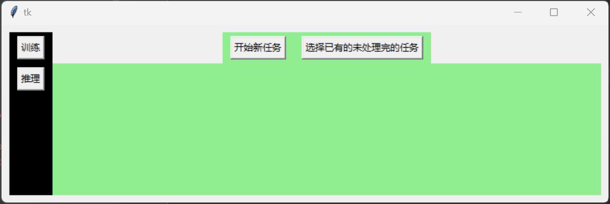

# 基于tkinter的OCR桌面应用程序

这是一个基于 python原生 **tkinter** 库进行开发的用于OCR任务中模型训练和推理的桌面应用程序。




---

### 所需依赖

由于使用了原生tkinter进行GUI部分的开发，GUI部分没有额外的依赖，因此所需依赖环境主要是深度学习框架和图像处理相关的库，所依赖的所有库均可通过conda进行安装。

其中深度学习框架依赖具体版本及其矩阵操作涉及的库如下

```
torch version: 2.0.1
cuda version: 11.8
cuDNN version: 8700
numpy
```

图像处理库依赖具体版本如下

```
opencv version: 4.8.1
```

OCR检测及其识别库所需依赖如下

```
modelscope
```


### 运行

1 使用git clone 命令下载本项目所有文件。

2 通过conda安装上述涉及的依赖包。

3 下载OCR模型对应的权重文件并放置在根目录下的assert文件夹内。

4 使用如pycharm运行项目根目录下的main.py文件。

---

### 项目目录

项目目录所涉及的主要文件夹和文件结构

pythonProject


|——assert    *资源文件夹，存放OCR模型描述文件及其权重文件*

|——common   *公共类文件夹，主要包括项目所使用的观察者模式、json、时间格式处理、、系统常量、系统运行状态等内容*

|——component   *自定义封装组件，里面根据项目需要对常用组件进行了再封装*

|——data      *存放待推理的数据和推理任务的结果数据，是推理任务的默认加载路径*

|——model    *负责加载和运行模型*

|——result    *保存推理任务中断后的中间结果记录，用于恢复中断的推理任务*


